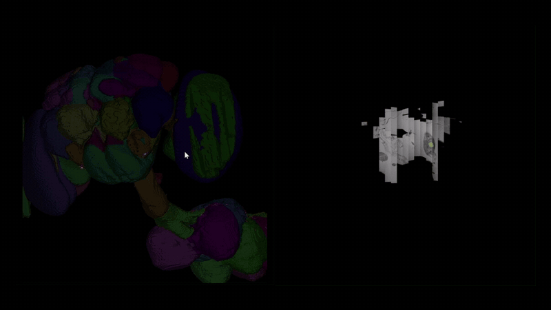
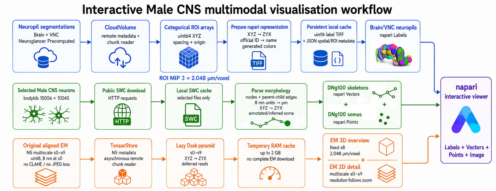

# Male CNS napari viewer

Interactive multimodal viewer for the Janelia FlyEM Male CNS connectome. It
combines remotely streamed electron microscopy, brain/VNC neuropil labels,
and selected neuron skeletons and somas in napari without downloading the
complete EM volume.

Developed during the BrainGlobe track at OSSS 2026.

## Demo

The animation shows interactive exploration of the Male CNS neuropils and a
frame-by-frame traversal through the spatial EM sections. The frames represent
consecutive anatomical sections, not time points.



## Workflow

The viewer brings three aligned data streams into the same napari coordinate
space: neuropil labels, selected neuronal morphologies, and multiscale EM.



## Same scientific layers

- Brain and VNC neuropil `Labels` at configurable ROI MIP 2 or 3.
- Selected Male CNS SWC skeleton `Vectors` and soma `Points`.
- Fixed-resolution original N5 3D overview.
- Full original N5 multiscale 2D detail pyramid.

## Performance additions

- Opens N5 scale metadata concurrently instead of sequentially.
- Uses configurable TensorStore and Dask worker counts.
- Reuses compatible TIFF/JSON and SWC artifacts from project 4.
- Prints timings for each workflow stage.
- Adds a CLAHE-JPEG multiscale layer for responsive 2D navigation while
  retaining the original N5 layer for lossless inspection.
- Shares one bounded TensorStore RAM cache across remote EM layers.

## Recommended napari workflow

### 3D

Use `Original EM N5 — 3D overview s8` together with neuropils, skeletons, and
somas. Its resolution is fixed by `overview_3d_mip` and does not change on zoom.

### Fast 2D navigation

1. Switch napari to 2D.
2. Hide the 3D overview.
3. Enable `Fast EM CLAHE-JPEG — 2D navigation`.
4. Move and zoom to locate the region of interest.

### Original 2D data

After locating a region, hide the fast layer and enable
`Original EM N5 — 2D full-resolution detail`. This source preserves the
original intensities but uses larger gzip-compressed 256-cubed N5 blocks.

### Playback step

`napari.playback_step_slices` controls how many native Z sections the slider
and play button advance per frame. It does not change the EM resolution or
remove MIP levels. With N5 s0 as the finest loaded level, one native section is
8 nm, so useful values include:

```text
1 slice    = 0.008 um per frame
16 slices  = 0.128 um per frame
64 slices  = 0.512 um per frame
128 slices = 1.024 um per frame
256 slices = 2.048 um per frame
```

Project 5 starts at `64` to reduce remote requests during playback. Set it to
`1` for consecutive original EM sections.

## Run

The existing `brainglobe-env` already includes TensorStore:

```powershell
& "$env:LOCALAPPDATA\miniconda3\envs\brainglobe-env\python.exe" ".\project_5\main.py"
```

From a clone of this repository, use:

```powershell
python main.py
```

## Configuration responsibilities

```text
dataset.mip                 neuropil resolution
em.detail_2d_mips           original N5 levels available in 2D
em.overview_3d_mip          fixed original N5 level used in 3D
em.fast_2d_mips             CLAHE-JPEG levels used for fast 2D navigation
em.cache_gb                 shared temporary TensorStore RAM-cache limit
napari.playback_step_slices native Z sections advanced by slider/play frame
performance.n5_open_workers concurrent metadata/network operations
performance.dask_workers    lazy-array computation workers
output.shared_cache_directories
                            compatible persistent TIFF/JSON/SWC caches
```

The RAM cache is temporary and disappears when the process closes. Total
application memory may exceed `cache_gb` because napari, Dask, label volumes,
decompression buffers, and GPU resources use additional memory.

## Timing output

With `performance.show_timings: true`, startup reports lines such as:

```text
[TIMING] neuropil layers: ... s
[TIMING] selected neurons: ... s
[TIMING] N5 metadata and lazy pyramid: ... s
[TIMING] workflow before napari: ... s
```

## Data attribution

This software does not redistribute the Male CNS volumes. It accesses the
public Janelia FlyEM Male CNS v1.0 sources configured in `config.json` and
caches only requested or generated artifacts locally. The underlying dataset
is provided by the Janelia FlyEM project under CC BY; consult the official
Male CNS download page and publication for dataset citation details.

## License

The software in this repository is released under the MIT License. Dataset
licensing and attribution remain governed by the original data providers.
